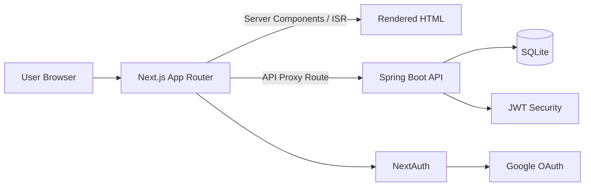

# Jack's Blog (Full-Stack)

개인 기술 블로그이자, 실서비스 관점의 풀스택 프로젝트입니다.

## 1. 프로젝트 소개

- **프로젝트명**: Jack's Blog
- **한 줄 소개**: Next.js(App Router) + Spring Boot 기반의 콘텐츠 중심 블로그 서비스
- **배포/운영 목적**: 글 작성, 검색, 댓글/리액션, 인증, SEO 최적화를 포함한 실제 서비스 형태 구현
- **대상 사용자**: 개발 콘텐츠를 읽는 방문자 + 관리자(콘텐츠 발행/수정)

---

## 2. 핵심 목표

- 단순 정적 페이지가 아닌 **실제 운영 가능한 블로그 서비스** 구현
- **SEO 친화적 구조**(metadata, sitemap, RSS, OG 이미지)로 검색 유입 확보
- 관리자 입장에서 **콘텐츠 생산성**(에디터, 임시저장/발행, 레거시 마이그레이션) 강화
- 사용자 입장에서 **읽기 경험**(빠른 로딩, 검색, 댓글/리액션, 반응형 UI) 개선

---

## 3. 기술 스택 (사용 이유)

### Frontend

- **Next.js 14 (App Router, TypeScript)**
  - 파일 기반 라우팅, 서버 컴포넌트/ISR 활용으로 초기 렌더링과 SEO를 동시에 확보하기 위해 사용
- **Tailwind CSS**
  - 컴포넌트 단위로 빠르게 UI를 설계하고 일관된 디자인 토큰을 유지하기 위해 사용
- **Recoil**
  - 테마/사이드바 등 UI 전역 상태를 간결하게 관리하기 위해 사용
- **TanStack Query**
  - 서버 상태 캐싱, 재요청 제어, 낙관적 UX를 안정적으로 처리하기 위해 사용
- **NextAuth (Google OAuth)**
  - 소셜 로그인/세션 처리를 표준화된 방식으로 구현하기 위해 사용

### Backend

- **Spring Boot 3 (Java 17)**
  - 안정적인 REST API 구성, 계층형 아키텍처, 확장성을 고려해 선택
- **Spring Security + JWT**
  - 관리자 인증/인가를 stateless 방식으로 처리하고 API 보안을 강화하기 위해 사용
- **Spring Data JPA**
  - 도메인 중심 데이터 접근, 쿼리 생산성, 유지보수성을 높이기 위해 사용
- **SQLite (개발/경량 운영)**
  - 단일 인스턴스 환경에서 간단하고 빠른 운영/백업을 위해 사용

### Infra / Tooling

- **Docker / Docker Compose**: 프론트-백엔드 로컬 통합 실행 및 환경 일관성 확보
- **Lighthouse**: 성능/접근성/SEO 지표 기반 개선 루프 운영
- **마이그레이션 스크립트**: 기존 Markdown 글을 API/DB로 이관해 운영 편의성 확보

---

## 4. 기여 내용

- Next.js App Router 기반 프론트 구조 설계 및 페이지/컴포넌트 구현
- Spring Boot API(게시글/댓글/리액션/관리자) 설계 및 보안(JWT) 적용
- SEO 기능 구축: `generateMetadata`, `sitemap.xml`, `feed.xml`, OG 이미지 라우트
- 검색/댓글/리액션/다크모드/관리자 에디터 등 사용자 기능 구현
- 레거시 Markdown 데이터 마이그레이션 자동화 스크립트 작성
- Lighthouse 기반 성능 개선 진행
  - 전역 애니메이션 비용 축소
  - 헤더 모달 lazy loading
  - 목록 응답 payload 슬림화

---

## 5. 문제 해결

### 1) 초기 로딩 성능 저하 (모바일 점수 하락)

- **문제**: 홈/전역 영역의 클라이언트 JS가 커져 LCP/TBT가 증가
- **해결**:
  - 전역 애니메이션의 framer-motion 의존을 CSS 애니메이션으로 전환
  - 검색 모달/사이드바를 dynamic import로 지연 로딩
  - 목록 데이터에서 불필요한 `contentHtml` 전달 제거
- **결과**: 초기 번들 부담 감소, 렌더링 지연 완화(지속 측정 중)

### 2) SEO 메타 정보 누락 위험

- **문제**: 페이지별 메타 데이터가 일관되지 않으면 검색 노출 품질 저하
- **해결**: App Router의 metadata API와 동적 메타 생성을 표준화, sitemap/RSS/OG 연동

### 3) 레거시 콘텐츠 운영 비효율

- **문제**: Markdown 기반 콘텐츠를 관리자 UI에서 직접 관리하기 어려움
- **해결**: 마이그레이션/업서트 스크립트 제공으로 DB 기반 운영 전환

---

## 6. 다이어그램 / 아키텍처



### 구조 요약

- **Frontend**: 라우팅/렌더링/SEO/클라이언트 UX 담당
- **Backend**: 비즈니스 로직/인증/데이터 영속화 담당
- **Auth**: 사용자 소셜 로그인(NextAuth) + 관리자 JWT 인증 분리

---

## 7. 서비스 주요 화면

- 홈: 소개 Hero, 최근 글, 기술 스택
- 포스트 목록: 카테고리/검색 기반 탐색
- 포스트 상세: 본문, 목차, 댓글, 리액션
- 관리자: 글 작성/수정 에디터, 발행 관리
- 방명록: 방문자 메시지 등록/조회

> 스크린샷은 `docs/screenshots/` 경로에 추가 후 아래처럼 연결하면 됩니다.

```md


```

---

## 로컬 실행

```bash
npm install
npm run dev
```

기본 주소: `http://localhost:3000`

## Lighthouse 측정

```bash
npm run lighthouse:mobile
npm run lighthouse:desktop
# or
npm run lighthouse:all
```

## 레거시 포스트 마이그레이션

```bash
API_URL=https://blog.jackihyun.me/api ADMIN_PASSWORD=<admin-password> npm run migrate:posts
```
